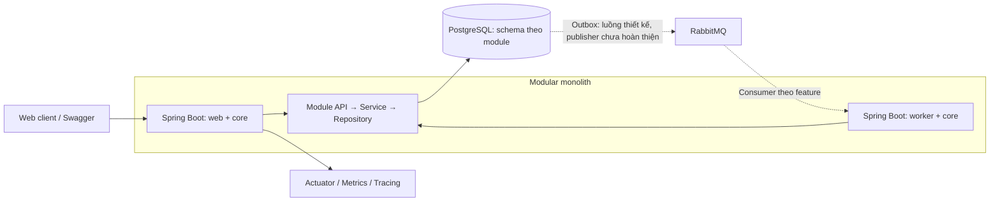
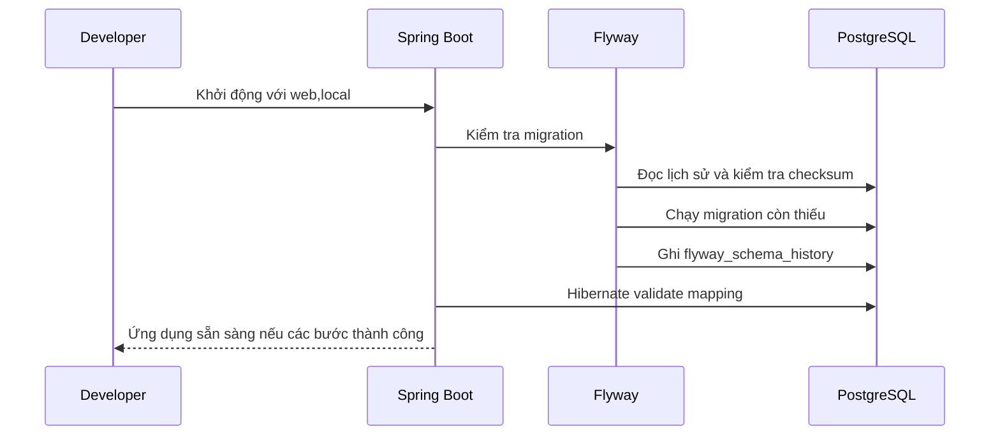

# Nitrogen Backend

Backend của **Nitrogen**, nền tảng học và luyện thi Hoá học THPT. Dự án tổ chức theo kiến trúc **modular monolith**: một ứng dụng Spring Boot, các module nghiệp vụ có ranh giới rõ ràng và sở hữu schema PostgreSQL riêng.

[Thiết kế dự án](docs/index.md) · [API contract](contracts/openapi/nitrogen-api.yaml) · [Quy ước code](docs/architecture/coding-conventions.md) · [CI](.github/workflows/ci.yml)

## Mục lục

- [Tổng quan](#tổng-quan)
- [Kiến trúc và công nghệ](#kiến-trúc-và-công-nghệ)
- [Yêu cầu môi trường](#yêu-cầu-môi-trường)
- [Setup local](#setup-local)
- [Chạy trong IntelliJ IDEA](#chạy-trong-intellij-idea)
- [Database và migration](#database-và-migration)
- [Swagger và kiểm tra API](#swagger-và-kiểm-tra-api)
- [Cấu hình và profile](#cấu-hình-và-profile)
- [Kiểm thử và chất lượng code](#kiểm-thử-và-chất-lượng-code)
- [Quy trình phát triển và release](#quy-trình-phát-triển-và-release)
- [Xử lý sự cố](#xử-lý-sự-cố)
- [Tài liệu tham khảo](#tài-liệu-tham-khảo)

## Tổng quan

Nitrogen hướng tới việc quản lý nội dung Hoá học, ngân hàng câu hỏi, luyện tập, thi thử và theo dõi tiến độ học tập. Repository này chứa backend, migration, API contract, kiểm thử và tài liệu kỹ thuật.

**Trạng thái triển khai:** dự án đang phát triển theo từng feature. Code hiện có nền tảng Identity (user, role, OAuth account, refresh/reset token), chức năng khởi tạo và tra cứu lượt luyện tập, cấu hình hạ tầng, kiểm thử kiến trúc và CI. Một số facade nghiệp vụ và outbox publisher vẫn là khung hoặc có `TODO`. Schema/token model đã có không đồng nghĩa với việc luồng đăng nhập, OAuth và reset password đã hoàn thiện qua HTTP.

Phạm vi các module:

| Module / schema | Trách nhiệm thiết kế |
|---|---|
| `identity` | Tài khoản, vai trò và dữ liệu xác thực |
| `curriculum` | Cấu trúc chương trình và chủ đề học tập |
| `chemistry` | Dữ liệu chuyên ngành Hoá học |
| `content` | Nội dung và tài liệu học tập |
| `assessment` | Câu hỏi, đáp án và chính sách chấm điểm |
| `examination` | Đề thi và nghiệp vụ thi |
| `practice` | Lượt luyện tập, câu trả lời và kết quả chấm |
| `progress` | Theo dõi tiến độ học tập |
| `flashcard` | Thẻ ghi nhớ |
| `simulation` | Mô phỏng học tập |
| `integration` | Outbox và chống xử lý message trùng |
| `administration` | Quản trị, audit log và security event |

Bảng trên mô tả ranh giới nghiệp vụ, không phải danh sách feature đã hoàn thành. Nguồn thiết kế tổng thể là *Nitrogen System Design & Database Design Specification v1.0* trong repository `nitrogen-docs`; các ký hiệu `§x.y` trong code tham chiếu đặc tả này.

## Kiến trúc và công nghệ

| Thành phần | Cấu hình trong repository |
|---|---|
| Ngôn ngữ | Java 21 |
| Framework | Spring Boot 4.1.1, Spring Modulith 2.1.1 |
| Build | Maven Wrapper, Maven 3.9.16 |
| Persistence | Spring Data JPA / Hibernate, PostgreSQL, Flyway |
| Messaging | RabbitMQ 3.13 Management trong môi trường local |
| API | Spring MVC, OpenAPI, Swagger UI |
| Kiểm thử | JUnit, Mockito, Testcontainers, ArchUnit |
| Chất lượng | Spotless, SpotBugs, JaCoCo, SonarQube Cloud |
| Vận hành | Actuator, Prometheus metrics, OpenTelemetry/OTLP |
| Container / CI | Docker Compose, GitHub Actions, GHCR, Trivy, CycloneDX |

Docker Compose local dùng **PostgreSQL 16**; `TestcontainersBase` dùng **PostgreSQL 18**. Đây là hai phiên bản hiện được cấu hình, cần lưu ý khi thay đổi SQL phụ thuộc phiên bản.



Các nguyên tắc chính:

- Module chỉ ghi dữ liệu vào schema do mình sở hữu.
- Giao tiếp xuyên module qua các interface công khai trong `api`, `dto`, `events`; không truy cập entity hoặc repository của module khác.
- Tham chiếu xuyên module dùng UUID, không dùng JPA association xuyên module.
- Transaction nằm ở service; REST trả DTO, không trả trực tiếp entity.
- Flyway quản lý thay đổi schema; Hibernate chỉ `validate`.
- Thiết kế durable event sử dụng `integration.outbox_events`; không bật thêm event publication registry của Spring Modulith.

Cấu trúc repository:

```text
nitrogen-backend/
├── .github/workflows/       # CI, scan và xuất bản container
├── .mvn/                   # Maven Wrapper
├── contracts/
│   ├── openapi/            # API contract
│   └── json-schema/        # Response, answer spec, scoring rule, message
├── docs/                   # Thiết kế, ADR và hướng dẫn vận hành
├── scripts/                # Khởi động, dừng và smoke test local
├── src/main/java/vn/nitrogen/
│   ├── common/             # Kiểu dữ liệu và tiện ích dùng chung
│   ├── platform/           # Security, messaging, observability, runtime
│   └── <module>/           # api, dto, events, domain, repository, service, web
├── src/main/resources/
│   ├── application*.yml    # Cấu hình theo runtime và môi trường
│   └── db/migration/       # Migration theo module
├── src/test/               # Unit, integration, architecture, migration test
├── .env.local.example
├── compose.local.yml
├── Dockerfile
└── pom.xml
```

`contracts/` nằm ngang hàng với `src/`. Maven đưa JSON Schema vào classpath khi build; không cần sao chép thủ công. Chỉ public response schema được dùng cho client; answer spec, scoring rule và message schema dành cho backend.

## Yêu cầu môi trường

| Công cụ | Khi nào cần |
|---|---|
| Git | Clone repository và làm việc theo nhánh |
| Docker Engine / Docker Desktop, Compose v2 | Chạy PostgreSQL, RabbitMQ, backend container và Testcontainers |
| JDK 21 | Chạy Maven, backend hoặc test trên máy; không bắt buộc nếu chỉ chạy toàn bộ bằng Docker |
| Bash và curl | Chạy các script local và smoke test |
| IntelliJ IDEA, DataGrip hoặc DBeaver | Tuỳ chọn cho phát triển và xem database |

Maven đã có Wrapper, không cần cài Maven riêng. Các lệnh dưới đây chạy từ thư mục `nitrogen-backend`, trong Bash hoặc zsh trên macOS/Linux; Windows có thể dùng WSL2.

```bash
git --version
docker version
docker compose version
java -version
```

Docker daemon phải đang chạy. Lần build đầu cần Internet để tải Maven distribution, dependency và container image.

## Setup local

### 1. Clone và tạo cấu hình

```bash
git clone https://github.com/nitrogen-nit/nitrogen-backend.git
cd nitrogen-backend
cp .env.local.example .env.local
```

Nếu đã có `.env.local`, giữ file hiện tại và đối chiếu với `.env.local.example`, tránh ghi đè cấu hình. `.env.local` đã được loại khỏi Git.

Các giá trị mặc định dùng cho môi trường local:

```dotenv
SPRING_PROFILES_ACTIVE=web,local
NITROGEN_ENVIRONMENT=local
NITROGEN_DB_NAME=nitrogen
NITROGEN_DB_URL=jdbc:postgresql://localhost:5432/nitrogen
NITROGEN_DB_USER=nitrogen
NITROGEN_DB_PASSWORD=nitrogen
NITROGEN_RABBIT_HOST=localhost
NITROGEN_RABBIT_PORT=5672
NITROGEN_RABBIT_USER=nitrogen
NITROGEN_RABBIT_PASSWORD=nitrogen
NITROGEN_WEB_PORT=8080
```

Đây là một phần của file mẫu, không thay thế toàn bộ file. Credentials mẫu chỉ dành cho local. Nếu file cũ đang trỏ tới RDS, cập nhật URL và credentials về PostgreSQL Docker trước khi chạy backend trên máy.

### 2A. Chạy toàn bộ bằng Docker

```bash
./scripts/local-up.sh
```

Script tạo `.env.local` nếu chưa có, khởi động PostgreSQL/RabbitMQ, build và chạy `backend-web`, rồi kiểm tra kết nối, health endpoint và lịch sử Flyway. Chạy lại lệnh này sau khi đổi code để rebuild backend container.

Các địa chỉ mặc định:

| Dịch vụ | Địa chỉ |
|---|---|
| Swagger UI | http://localhost:8080/swagger-ui.html |
| OpenAPI JSON | http://localhost:8080/v3/api-docs |
| Backend readiness | http://localhost:8080/actuator/health/readiness |
| RabbitMQ Management | http://localhost:15672 — tài khoản mẫu `nitrogen` / `nitrogen` |
| PostgreSQL | `localhost:5432`, database `nitrogen` |

### 2B. Chạy backend trên máy, hạ tầng bằng Docker

Cách này phù hợp khi cần debug hoặc sửa code thường xuyên. Chỉ chọn một cách chạy backend để tránh tranh cổng `8080`.

```bash
# Nếu backend container đã được chạy bằng cách 2A, dừng nó trước.
docker compose --env-file .env.local -f compose.local.yml stop backend-web

# Khởi động database và broker, chờ health check thành công.
docker compose --env-file .env.local -f compose.local.yml up -d --wait postgres rabbitmq

# Kiểm tra Java/Maven rồi chạy backend trên máy.
./mvnw -v
./scripts/run-web-dev.sh
```

Script chạy Maven với profile lấy từ `SPRING_PROFILES_ACTIVE`, mặc định `web,local`. Dùng `Ctrl+C` để dừng backend.

Backend chạy trên máy kết nối `localhost`; backend chạy trong Compose kết nối hostname `postgres` và `rabbitmq` do Compose truyền vào. `localhost` bên trong container là chính container đó.

### 3. Kiểm tra và quản lý môi trường

```bash
# Kiểm tra container và log.
docker compose --env-file .env.local -f compose.local.yml ps
docker compose --env-file .env.local -f compose.local.yml logs --tail=100 backend-web

# Chạy lại smoke test, áp dụng cả backend Docker lẫn backend trên máy.
./scripts/local-smoke.sh

# Dừng container, giữ dữ liệu PostgreSQL và RabbitMQ.
./scripts/local-down.sh
```

Nếu backend chạy trong IntelliJ hoặc terminal, dừng tiến trình đó riêng trước khi tắt hạ tầng.

Chỉ khi muốn tạo lại hoàn toàn dữ liệu local:

```bash
# XÓA volume PostgreSQL và RabbitMQ của môi trường local.
./scripts/local-reset.sh --yes
./scripts/local-up.sh
```

Reset không phải bước setup thông thường và không dùng để sửa lỗi trên database dùng chung.

## Chạy trong IntelliJ IDEA

1. Mở thư mục `nitrogen-backend` hoặc `pom.xml` dưới dạng Maven project.
2. Đặt **Project SDK** và JRE của Maven Runner thành **JDK 21**; chọn Maven Wrapper.
3. Thực hiện bước **2B** để khởi động PostgreSQL và RabbitMQ, bỏ qua lệnh chạy backend bằng script nếu chạy bằng IDE.
4. Tạo Run/Debug Configuration cho `vn.nitrogen.NitrogenApplication`.
5. Đặt **Working directory** là thư mục gốc `nitrogen-backend`.
6. Đặt **Active profiles** thành `web,local`. Nếu configuration không có trường này, dùng program argument `--spring.profiles.active=web,local`.
7. Run hoặc Debug, sau đó mở Swagger UI.

`application.yml` đã có `spring.config.import: optional:file:.env.local[.properties]`; Spring tự nạp file khi working directory đúng. Không bắt buộc cài EnvFile. Kiểm tra các environment variable trong Run Configuration nếu chúng ghi đè cấu hình local.

Nếu Maven panel trống: kiểm tra `pom.xml` không nằm trong **Maven → Ignored Files**, rồi đồng bộ lại Maven project.

## Database và migration

### Kết nối từ DataGrip / DBeaver

Tạo data source PostgreSQL và nhập giá trị tương ứng trong `.env.local`:

| Trường | Mặc định local |
|---|---|
| Host | `localhost` |
| Port | `5432` |
| Database | `nitrogen` |
| User | `nitrogen` |
| Password | `nitrogen` |
| JDBC URL | `jdbc:postgresql://localhost:5432/nitrogen` |

Chọn **Test Connection**, sau đó chọn các schema nghiệp vụ và `flyway_history` để hiển thị bảng. Không cần cài PostgreSQL trực tiếp trên máy.

Có thể vào `psql` trong container với credentials mẫu:

```bash
docker compose --env-file .env.local -f compose.local.yml exec postgres \
  psql -U nitrogen -d nitrogen
```

### Cách Flyway hoạt động

Khi khởi động với `local` hoặc `dev`, Flyway chạy migration còn thiếu trước khi Hibernate kiểm tra mapping. Trong `prod`, Flyway bị tắt trong ứng dụng; quy trình triển khai phải chạy migration riêng trước rollout.



Quy ước file mới:

```text
src/main/resources/db/migration/<module>/V<yyyyMMddHHmm>__<module>_<description>.sql
```

- Version phải duy nhất toàn repository; kiểm tra trùng version khi nhiều nhánh cùng thêm migration.
- Không sửa migration đã chạy trên môi trường chung; bổ sung migration mới.
- Giữ `spring.flyway.locations=classpath:db/migration` để quét các thư mục module.
- Không dùng `ddl-auto=update` để thay thế migration.
- Kiểm thử cả tạo database mới và nâng cấp từ schema cũ khi thay đổi có ảnh hưởng dữ liệu.

Kiểm tra lịch sử sau khi ứng dụng khởi động:

```sql
SELECT installed_rank, version, description, script, installed_on, success
FROM flyway_history.flyway_schema_history
ORDER BY installed_rank;
```

## Swagger và kiểm tra API

```bash
curl -fsS http://localhost:8080/actuator/health/liveness
curl -fsS http://localhost:8080/actuator/health/readiness
curl -fsS http://localhost:8080/v3/api-docs
```

Health endpoint trả JSON có `"status":"UP"` khi các thành phần tương ứng sẵn sàng. Readiness hiện kiểm tra trạng thái ứng dụng và database; dùng smoke test để kiểm tra thêm RabbitMQ.

Mở [Swagger UI local](http://localhost:8080/swagger-ui.html) để xem endpoint, request và response. Contract được lưu tại [`contracts/openapi/nitrogen-api.yaml`](contracts/openapi/nitrogen-api.yaml).

**Giới hạn xác thực hiện tại:** `SecurityConfig` mở các endpoint health/info/prometheus và Swagger/OpenAPI; các request còn lại yêu cầu xác thực. JWT resource server chưa được cấu hình hoàn chỉnh, HTTP Basic và form login đang tắt. Vì vậy `/` hoặc `/health` có thể trả `401`; dùng `/actuator/health` để kiểm tra ứng dụng. Việc mở được Swagger chưa đảm bảo gọi được API nghiệp vụ bằng “Try it out”.

Các lớp trong package `api` là facade Java nội bộ giữa module; endpoint HTTP thuộc package `web`. Không phải mọi module API đều xuất hiện trên Swagger.

## Cấu hình và profile

Ứng dụng dùng một artifact, kết hợp **profile vai trò** với **profile môi trường**:

| Profile | Ý nghĩa |
|---|---|
| `web` | Chạy HTTP API và scheduler; kéo theo `core` |
| `worker` | Vai trò consumer; kéo theo `core`, vẫn có servlet/Actuator trên cổng mặc định `8081` |
| `local` | Default kết nối local, Flyway bật, tracing tắt mặc định |
| `dev` | Endpoint và credentials từ biến môi trường, Flyway bật |
| `prod` | Secrets từ môi trường triển khai, Flyway tắt, Hibernate `validate` |

Ví dụ: `web,local`, `worker,dev`, `web,prod`. Tên nhánh Git `dev` không tự kích hoạt Spring profile `dev`.

Chạy vai trò worker trên máy, với `.env.local` và hạ tầng đã sẵn sàng:

```bash
./mvnw spring-boot:run -Dspring-boot.run.profiles=worker,local
```

Consumer xử lý nghiệp vụ phụ thuộc feature đã triển khai; bật profile không tự bổ sung các chức năng còn `TODO`.

Các biến thường cần điều chỉnh:

| Nhóm | Biến |
|---|---|
| Database | `NITROGEN_DB_URL`, `NITROGEN_DB_USER`, `NITROGEN_DB_PASSWORD`, `NITROGEN_DB_POOL_SIZE` |
| RabbitMQ | `NITROGEN_RABBIT_HOST`, `NITROGEN_RABBIT_PORT`, `NITROGEN_RABBIT_USER`, `NITROGEN_RABBIT_PASSWORD` |
| HTTP local | `NITROGEN_WEB_PORT`, `NITROGEN_RABBIT_MANAGEMENT_PORT` |
| Logs / version | `NITROGEN_LOG_LEVEL`, `NITROGEN_APPLICATION_VERSION`, `NITROGEN_ENVIRONMENT` |
| Tracing | `NITROGEN_TRACING_ENABLED`, `NITROGEN_TRACING_SAMPLING_PROBABILITY`, `NITROGEN_OTLP_ENDPOINT` |

Compose cố định host port PostgreSQL `5432` và AMQP `5672`; thay biến kết nối ứng dụng không tự đổi các port mapping này. Local không yêu cầu MinIO/S3 hay observability stack để bootstrap; chúng không nằm trong `compose.local.yml`.

Xem đầy đủ tại [Environment and secrets](docs/environment-and-secrets.md) và [Observability](docs/observability.md). Không đưa `.env.local`, token, private key hoặc mật khẩu môi trường chung vào Git.

## Kiểm thử và chất lượng code

### Kiểm tra trước khi commit

```bash
# Format và phân tích tĩnh, tương ứng job backend-format.
./mvnw -B --no-transfer-progress -DskipTests compile spotless:check spotbugs:check

# Toàn bộ test, đóng gói và kiểm tra ngưỡng JaCoCo; cần Docker đang chạy.
./mvnw -B --no-transfer-progress clean verify
```

`verify` chạy JaCoCo nhưng không tự gọi `spotless:check`, `spotbugs:check` hoặc `sonar:sonar`; cần các lệnh riêng như trên. `spotless:apply` sửa định dạng file và nên được review trước khi commit.

Chạy nhanh từng nhóm:

```bash
./mvnw test -Punit
./mvnw test -Parchitecture
./mvnw test -Pintegration
./mvnw test -Pmigration

# Bỏ qua test gắn @Tag("docker") khi Docker chưa có.
./mvnw test -Pno-docker
```

Testcontainers tạo container riêng cho kiểm thử, không cần bật stack Compose local. PostgreSQL thật được dùng để kiểm tra JSONB, partial index và constraint. Chạy nhóm test riêng hoặc `no-docker` không thay thế kiểm thử đầy đủ trước merge; `verify -Pno-docker` vẫn kiểm tra coverage và có thể không đạt ngưỡng do bỏ qua integration test.

### Báo cáo

| Báo cáo | Vị trí sau khi chạy thành công |
|---|---|
| Kết quả test | `target/surefire-reports/` |
| JaCoCo HTML | `target/site/jacoco/index.html` |
| JaCoCo XML | `target/site/jacoco/jacoco.xml` |
| Dependency SBOM | `target/bom.json` |

Ngưỡng JaCoCo hiện tại trong `pom.xml`: **line coverage ≥ 80%**, **branch coverage ≥ 70%**, áp dụng ở cấp bundle sau các exclusion được cấu hình. SonarQube có Quality Gate riêng, không đồng nghĩa với JaCoCo local.

Trên macOS, mở báo cáo bằng:

```bash
open target/site/jacoco/index.html
```

### SonarQube Cloud

CI đọc `SONAR_HOST_URL`, `SONAR_ORGANIZATION` từ GitHub Actions Variables và `SONAR_TOKEN` từ Actions Secrets. Project key nằm trong `pom.xml`: `nitrogen-nit_nitrogen-backend`.

Khi cần chạy thủ công, cung cấp `SONAR_TOKEN` qua môi trường an toàn, không ghi token trực tiếp vào command history hoặc file được commit:

```bash
./mvnw -B --no-transfer-progress verify sonar:sonar \
  -Dsonar.host.url=https://sonarcloud.io \
  -Dsonar.organization=nitrogen-nit
```

Chỉ chạy phân tích cho nhánh được gói dịch vụ hỗ trợ. Theo [tài liệu subscription của SonarQube Cloud](https://docs.sonarsource.com/sonarqube-cloud/administering-sonarcloud/managing-subscription/subscription-plans), Free plan hỗ trợ branch analysis cho nhánh chính và PR analysis khi đích là nhánh chính. Repository public không tự chứng minh organization đang dùng OSS plan.

Nếu gặp `Organization is not allowed to access data from non main branches`, báo cáo có thể đã upload thành công nhưng organization không được đọc kết quả của nhánh đó. Kiểm tra gói dịch vụ và nhánh chính trên Sonar; không xử lý bằng cách giả tên nhánh thành `main` hoặc coi bỏ chờ Quality Gate là đã đạt chất lượng.

Với flow `feature → dev → main` và Free plan, nên giữ test/JaCoCo độc lập trên mọi PR và giới hạn Sonar ở push `main` hoặc PR vào `main`. **Workflow hiện tại chưa có điều kiện giới hạn này**; xem phần xử lý sự cố trước khi áp dụng.

## Quy trình phát triển và release

```mermaid
flowchart LR
    Dev[dev đã đồng bộ] --> Feature[feat/NIT-task]
    Feature --> Checks[Test local + review diff]
    Checks --> PR[PR feature → dev]
    PR --> CI[CI + review]
    CI --> Merge[Merge vào dev]
    Merge --> Release[PR dev → main]
    Release --> Gate[CI + Sonar nếu được hỗ trợ]
    Gate --> Main[Merge main]
    Main --> Image[Build + Trivy + GHCR]
    Image --> Deploy[Migration riêng + triển khai + smoke test]
```



Bắt đầu task khi working tree sạch:

```bash
git switch dev
git pull --ff-only origin dev
git switch -c feat/nit-xxx-short-description
```

Sau khi code và kiểm thử, stage đúng file của task, kiểm tra `git diff --cached`, commit rồi push nhánh feature. Tạo PR vào `dev`; chỉ đánh dấu các checklist test/CI khi đã có kết quả thực tế. Khi sẵn sàng release, tạo PR `dev → main`, giữ lại hai nhánh lâu dài này sau merge.

CI hiện chạy trên PR vào `dev`/`main`, push lên `dev`/`main` và khi kích hoạt thủ công. Container workflow build và scan ở PR; sau Backend CI thành công trên `main`, workflow có thể publish image vào `ghcr.io/nitrogen-nit/nitrogen-backend`. Workflow cũng hỗ trợ tag `v*.*.*` và chạy thủ công. Luồng tag/thủ công không tự bảo đảm commit đã qua Backend CI, nên chỉ release commit đã được xác minh.

Image dùng tag theo SHA và thêm version tag khi chạy từ Git tag. Repository hiện có pipeline build/publish image; việc publish không đồng nghĩa với đã deploy ứng dụng. Production cần bước migration riêng, secrets runtime, rollout và kiểm tra health.

Khi thêm module mới: khai báo `@ApplicationModule` và `allowedDependencies`, công bố package bằng `@NamedInterface`, bổ sung migration và bộ test kiến trúc tương ứng. Đọc [review checklist](docs/architecture/review-checklist.md) trước khi mở PR.

## Xử lý sự cố

| Hiện tượng | Kiểm tra / cách xử lý |
|---|---|
| `zsh: command not found: docker` trên macOS | Mở Docker Desktop; nếu CLI chưa có trong PATH, dùng `export PATH="/Applications/Docker.app/Contents/Resources/bin:$PATH"` trong terminal hiện tại, rồi kiểm tra `docker version`. Script local có cơ chế tìm CLI tại vị trí này. |
| Không kết nối được Docker daemon | Khởi động Docker Desktop/Engine, kiểm tra `docker info` và `docker context show`. |
| PostgreSQL `Connection refused` | Kiểm tra container `postgres` healthy, port `5432` và JDBC URL. Backend trên máy dùng `localhost`; backend Compose dùng `postgres`. |
| Đã đổi password trong `.env.local` nhưng DB vẫn từ chối | Volume PostgreSQL đã khởi tạo giữ credentials cũ. Đổi mật khẩu trong database hoặc dùng credentials đúng; sửa biến bootstrap không đổi mật khẩu trong volume hiện có. |
| RabbitMQ `AmqpConnectException` | Kiểm tra container, port AMQP `5672`, hostname và credentials. Port `15672` là giao diện quản trị, không phải AMQP. |
| Cổng `8080` đang được dùng | Dừng backend container trước khi chạy IntelliJ, hoặc cấu hình port khác qua `NITROGEN_WEB_PORT`. |
| `/` hoặc `/health` trả `401` | Dùng `/actuator/health/readiness` hoặc Swagger; kiểm tra phần xác thực ở trên. |
| Flyway checksum mismatch | Đối chiếu migration với phiên bản đã chạy, khôi phục file gốc và thêm migration mới. Không tự `repair` lịch sử database dùng chung. |
| Hibernate schema validation thất bại | Kiểm tra đúng database/profile và migration mới đã chạy; không chuyển sang `ddl-auto=update` để che lỗi. |
| Testcontainers không tìm thấy Docker | Kiểm tra Docker daemon và context trong cùng môi trường terminal/IDE chạy test. |
| JaCoCo không đạt sau khi chỉ chạy một nhóm test | Chạy `clean verify` với toàn bộ test; đọc report và bổ sung test cho nhánh logic thiếu. |
| Sonar từ chối dữ liệu ngoài main | Giới hạn job Sonar theo gói dịch vụ; duy trì job `verify` độc lập để coverage vẫn được kiểm tra trên `dev`. |

Để điều chỉnh CI cho Sonar Free, thêm điều kiện ở cấp job `backend-sonar` (giả sử nhánh chính trên Sonar là `main`):

```yaml
if: >-
  (github.event_name == 'push' && github.ref == 'refs/heads/main') ||
  (github.event_name == 'pull_request' && github.base_ref == 'main' &&
   github.event.pull_request.head.repo.full_name == github.repository) ||
  (github.event_name == 'workflow_dispatch' && github.ref == 'refs/heads/main')
```

Đồng thời tách lệnh `./mvnw clean verify` thành job coverage chạy cho mọi PR/push được CI hỗ trợ, và đưa job này vào các dependency cần thiết trước build/release. Hiện `verify` chỉ được gọi trong job Sonar; nếu chỉ skip Sonar trên `dev`, CI sẽ bỏ luôn kiểm tra ngưỡng JaCoCo ở nhánh đó. Đối chiếu required checks của branch rules để không yêu cầu check Sonar không được tạo cho PR vào `dev`.

## Tài liệu tham khảo

- [Mục lục tài liệu thiết kế](docs/index.md)
- [Thiết kế Identity](docs/design/identity.md)
- [Module ownership](docs/architecture/module-ownership.md)
- [Coding conventions](docs/architecture/coding-conventions.md)
- [REST API conventions](docs/architecture/rest-api-conventions.md)
- [Review checklist](docs/architecture/review-checklist.md)
- [Architecture Decision Records](docs/adr/)
- [Environment and secrets](docs/environment-and-secrets.md)
- [Observability](docs/observability.md)

Các tài liệu chi tiết có thể mô tả thiết kế ở giai đoạn trước; đối chiếu migration, code và test của nhánh đang làm việc khi xác định trạng thái triển khai.
