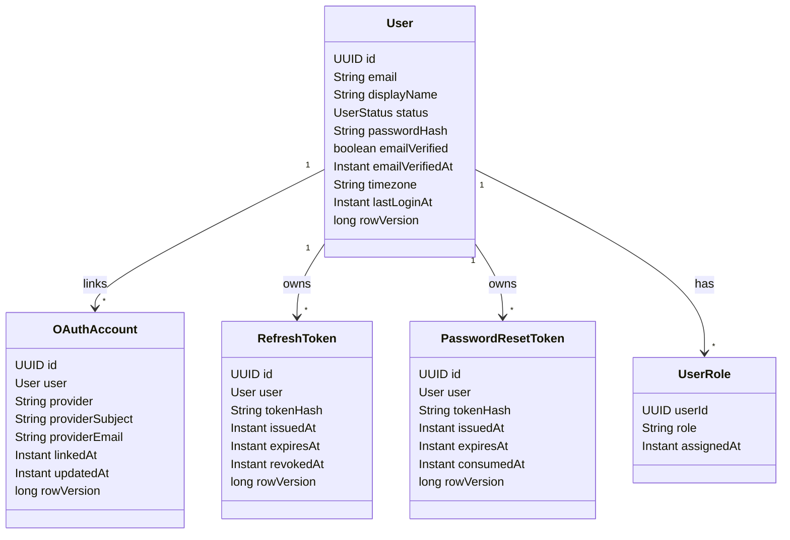
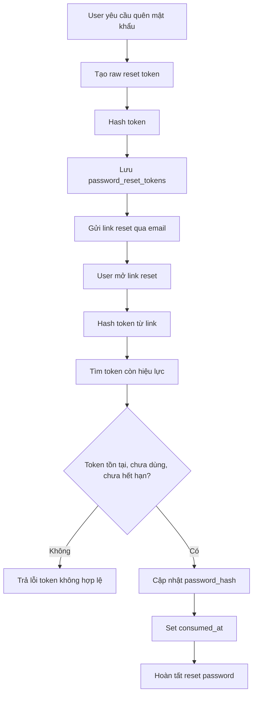
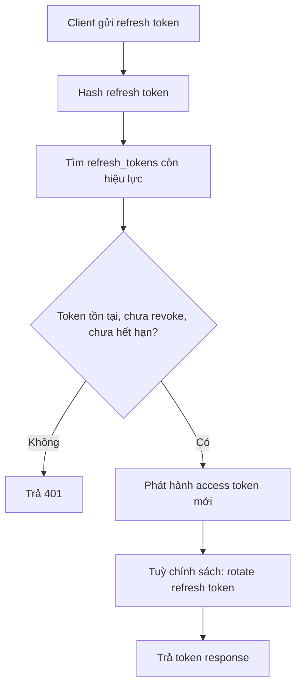
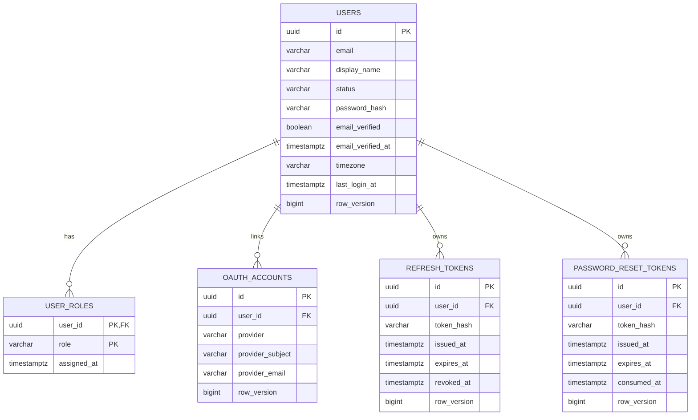

# Identity Schema And Token Model

Tài liệu này mô tả phần nền tảng của module Identity: user, role, OAuth account, refresh token và password reset token.

## UML

## Password Reset Flow

## Refresh Token Flow

## Database Tables

