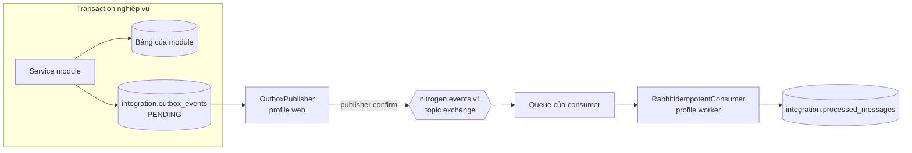
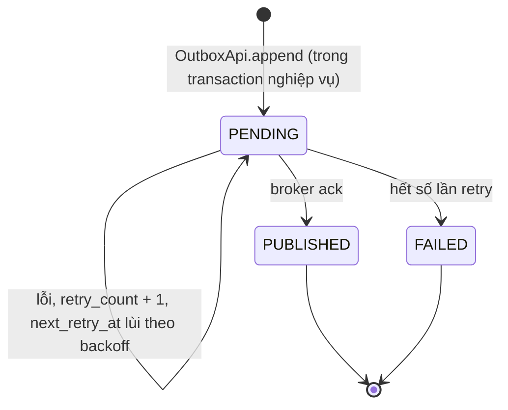
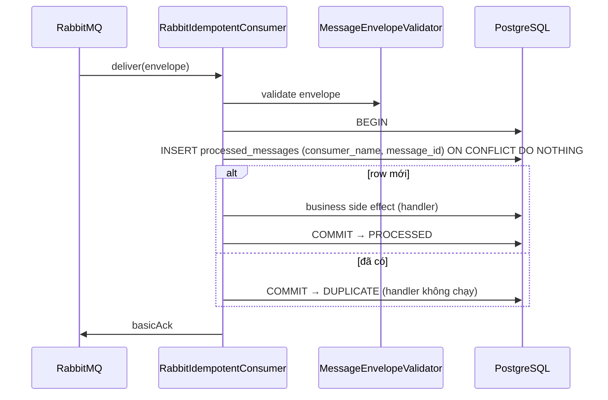

# Messaging, Outbox And Idempotent Consumer

Tài liệu này mô tả đường đi của một event từ transaction nghiệp vụ tới consumer: RabbitMQ topology, transactional outbox, outbox publisher và idempotent consumer. Quyết định nền tảng nằm ở [ADR 0003](../adr/0003-transaction-and-outbox-boundaries.md).

## Tổng quan



- Module ghi dữ liệu và outbox row trong **cùng một transaction** qua `OutboxApi.append` (`Propagation.MANDATORY` — gọi ngoài transaction là lỗi).
- Không module nào gọi RabbitMQ trực tiếp từ trong transaction.
- Consumer chống xử lý trùng bằng `integration.processed_messages`; message có thể đến nhiều lần (at-least-once), side effect chỉ xảy ra một lần.

## RabbitMQ Topology

Khai báo tập trung ở `RabbitTopologyConfig`; tên nằm trong `MessagingTopology`.

| Thành phần | Tên | Ghi chú |
|---|---|---|
| Event exchange | `nitrogen.events.v1` | Topic, durable. Publisher đẩy mọi event vào đây theo `routing_key` của outbox row. |
| Retry exchange | `nitrogen.retry.v1` | Topic, durable. |
| Retry queue | `nitrogen.retry.30s.v1` | Quorum, TTL 30 giây, dead-letter quay lại `nitrogen.events.v1`. Bind `#`. |
| Dead-letter exchange | `nitrogen.dead-letter.v1` | Topic, durable. |
| Dead-letter queue | `nitrogen.events.dlq.v1` | Quorum. Bind `#`. |

Queue của từng consumer do feature sở hữu consumer đó khai báo. Event không có queue nào bind sẽ bị broker trả về và publisher ghi nhận như lỗi publish (xem bên dưới).

## Message Envelope

Mọi message dùng `MessageEnvelope` (§17.3), serialize JSON:

| Field | Ý nghĩa |
|---|---|
| `messageId` | Id outbox row; khoá dedup phía consumer |
| `messageType` | `event_type` của outbox row, ví dụ `identity.UserRegistered` |
| `schemaVersion` | Phiên bản payload; consumer phải kiểm tra tường minh |
| `correlationId` | Nối các message cùng một luồng nghiệp vụ |
| `causationId` | `messageId` đã sinh ra message này (có thể null) |
| `aggregateType`, `aggregateId` | Aggregate nguồn |
| `occurredAt` | Thời điểm sự kiện xảy ra, không phải lúc publish |
| `payload` | JSON object, validate theo `contracts/json-schema/messages/` |

Envelope là contract xuyên phiên bản: khi rolling deploy, message do bản mới phát có thể tới worker bản cũ. Không đổi ngữ nghĩa của một `schemaVersion` đã phát hành (§13.3).

## Transactional Outbox

Bảng `integration.outbox_events`; vòng đời một row:



`OutboxApi.findFailed(limit)` trả các row `FAILED` cho màn hình vận hành.

## Outbox Publisher

`OutboxPublisher` chạy ở profile `web` (scheduler chỉ bật ở `web` — xem `SchedulingConfig`), theo chu kỳ `publish-interval`. Spring AMQP bật `publisher-confirm-type: correlated`, `publisher-returns` và `template.mandatory`.

1. **Claim** — `claimPending` chọn tối đa `batch-size` row có `status = 'PENDING'`, `next_retry_at <= now` và chưa bị giữ (`locked_until` null hoặc đã hết hạn), theo thứ tự `occurred_at`, bằng `FOR UPDATE SKIP LOCKED`; ghi `locked_by = worker id`, `locked_until = now + lease-duration`, rồi **commit**.
2. **Publish ngoài transaction** — gửi envelope vào `nitrogen.events.v1` với publisher confirm và mandatory return, chờ tối đa `confirm-timeout`.
3. **Ghi kết quả** — chỉ worker đang giữ lease mới cập nhật được row:
   - ack và không bị trả về → `PUBLISHED`;
   - nack, bị trả về, timeout hoặc exception → tăng `retry_count`, lùi `next_retry_at` theo exponential backoff; đủ `max-retries` → `FAILED`.

Nhiều replica chạy song song an toàn: `SKIP LOCKED` và lease ngăn hai worker cùng claim một row; replica chết giữa chừng thì lease hết hạn và row được worker khác claim lại.

Mã lỗi ghi vào `last_error_code`:

| Mã | Khi nào |
|---|---|
| `RABBIT_CONFIRM_NACK` | Broker nack |
| `RABBIT_MESSAGE_RETURNED` | Không queue nào nhận routing key |
| `RABBIT_CONFIRM_TIMEOUT` | Không có confirm trong `confirm-timeout` |
| `RABBIT_PUBLISH_ERROR` | Exception khi gửi |
| `RABBIT_PUBLISH_INTERRUPTED` | Thread bị interrupt |

### Cấu hình

| Property | Biến môi trường | Mặc định |
|---|---|---|
| `nitrogen.outbox.publish-interval` | `NITROGEN_OUTBOX_PUBLISH_INTERVAL` | `PT5S` |
| `nitrogen.outbox.batch-size` | `NITROGEN_OUTBOX_BATCH_SIZE` | `100` |
| `nitrogen.outbox.lease-duration` | `NITROGEN_OUTBOX_LEASE_DURATION` | `PT30S` |
| `nitrogen.outbox.confirm-timeout` | `NITROGEN_OUTBOX_CONFIRM_TIMEOUT` | `PT10S` |
| `nitrogen.outbox.max-retries` | `NITROGEN_OUTBOX_MAX_RETRIES` | `8` |
| `nitrogen.outbox.retry-base-delay` | `NITROGEN_OUTBOX_RETRY_BASE_DELAY` | `PT5S` |
| `nitrogen.outbox.retry-max-delay` | `NITROGEN_OUTBOX_RETRY_MAX_DELAY` | `PT15M` |
| `nitrogen.outbox.worker-id` | — | `${HOSTNAME}-<uuid>` |

Backoff: lần retry thứ *n* chờ `retry-base-delay × 2^(n-1)`, không vượt `retry-max-delay` (mặc định 5s, 10s, 20s, … tối đa 15 phút).

## Idempotent Consumer

Consumer trong module dùng `RabbitIdempotentConsumer` với manual acknowledgement:



- Dedup marker và side effect commit **cùng nhau**: handler lỗi thì rollback cả hai, message không được ack và sẽ được giao lại.
- Khoá dedup là `(consumer_name, message_id)` — nhiều consumer khác nhau cùng nhận một message vẫn xử lý độc lập.
- Envelope thiếu field bắt buộc ném `InvalidMessageEnvelopeException` trước khi chạm DB.

Ví dụ minh hoạ — hiện chưa có consumer nghiệp vụ nào trong codebase:

```java
@RabbitListener(queues = "progress.user-registered.v1", ackMode = "MANUAL")
void onUserRegistered(MessageEnvelope envelope, Channel channel,
                      @Header(AmqpHeaders.DELIVERY_TAG) long tag) throws Exception {
    rabbitIdempotentConsumer.processAndAcknowledge(
            "progress.user-registered", envelope, channel, tag,
            message -> progressService.initialize(message.aggregateId()));
}
```

`@RabbitListener` chỉ đăng ký ở profile `worker`. Cấu hình listener ở `application-worker.yml`:

| Property | Biến môi trường | Mặc định |
|---|---|---|
| `spring.rabbitmq.listener.simple.acknowledge-mode` | — | `manual` |
| `spring.rabbitmq.listener.simple.prefetch` | `NITROGEN_RABBIT_PREFETCH` | `10` |
| `spring.rabbitmq.listener.simple.concurrency` | `NITROGEN_RABBIT_CONCURRENCY` | `2` |
| `spring.rabbitmq.listener.simple.max-concurrency` | `NITROGEN_RABBIT_MAX_CONCURRENCY` | `8` |
| `spring.rabbitmq.listener.simple.default-requeue-rejected` | — | `false` (message bị reject không quay vòng vô hạn) |

## Dọn dẹp `processed_messages`

Bảng có index `ix_processed_messages_processed_at` để dọn theo thời gian; job dọn dẹp chưa được hiện thực.
